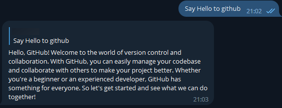

# LLaMa telegram bot



## Supported models

All models based on LLaMa and converted into the latest GGML format, such as Alpaca, Vicuna, Gpt4All and others.

## Features

* Loading LLaMa models (obviously) and providing a bot interface in Telegram
* FIFO queue for tasks (several users can send tasks to LLaMa model and get a response as soon as it is generated)
* Simple history

## How to set up

1. Place the model weight(ggml format) somewhere
2. Create a Telegram bot and obtain a bot token.
2. Install requirements  
`pip install -r requirements.txt`
3. Run
`python main.py "TELEGRAM_BOT_TOKEN" -m PATH_TO_MODEL`
4. Enjoy

## Usage
```commandline
LLaMa telegram bot

positional arguments:
  token                 Telegram bot token

options:
  -h, --help            show this help message and exit
  -m MODEL, --model MODEL
                        Path to the LLaMa model
  -t THREADS, --threads THREADS
                        Number of threads to use
  --max-tokens MAX_TOKENS
                        The maximum number of tokens to generate
  --enable-history      Simulate memory in a chatbot
  --skip-init-prompt    Skip the initial prompt (faster startup)
  --debug               Enable debug logging
```


## How to tune

Prompt is tuned currently for Alpaca's models, but also can be tuned for [Vicuna](https://vicuna.lmsys.org/) model, or you can write your own in the `init_prompt` and `a/q_prompt` variables in main.py. 

Example:  
```python
init_prompt = "Below is an instruction that describes a task. Write a short response that appropriately completes the " \
              "request. Answer briefly but clearly.\n"
q_prompt = "### Instruction:"
a_prompt = "### Response:"

user_prompt = "What is the task you need to complete?"  # This is the prompt that the user sends to bot

prompt = f"{init_prompt}\n{q_prompt} {user_prompt}\n{a_prompt}"  # Final prompt to be passed on to the model
``` 

Although apparently, the latest models such as WizardLM don't care if you write Instruction or Human since their dataset contained both parts of the Alpaca and parts of the Vicuna dataset.

Or I could be wrong. Try it yourself.

## FAQ

*Q*: I have this error "error loading model: unrecognized tensor type 4/5"

*A*: Looks like you are using old llama.cpp. Try to update the `llama-cpp-python` package